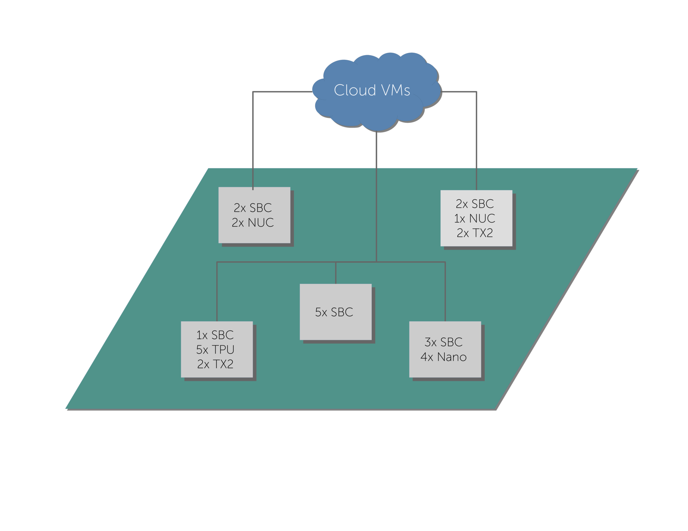

# workload-aware-k8s
Contains custom Kubernetes priority functions that make the scheduler workload-aware, and extensions to faas-sim.

# General description

This project was developed to create a workload-aware scheduler by implementing three [priority functions](https://kubernetes.io/docs/reference/scheduling/policies/#priorities) that work with the Kubernetes scheduler.
These target:
* Performance (`hwmapping.faas.priorities.ExecutionTimePriority`)
* Resources (`hwmapping.faas.priorities.ResourceContentionPriority`)
* Capabilities (`hwmapping.faas.priorities.CapabilityMatchingPriority`)

To implement these functions we presume following knowledge:
* Function Execution Time (FET) for each function on each node
* Resource usage for each function on each node
  * Represented by a vector that contains the usage for a single function invocation (i.e., CPU/GPU usage %)
* Capabilities of each node in the cluster
  * Capabilities can take many forms, but we assume them to describe hardware characteristics (i.e., CPU model, GPU,...)

* The performance-oriented priority function uses the FET data and prefers nodes with lower FET.
* The resource-contention priority function prefers nodes with lower resource utilization. 
  This function uses our estimated resource usages that we collected for each node.
  Therefore, the estimation is tailored to the actual device and application and takes differences in usage 
  across devices into account.
* The capability matching priority uses the pre-computed requirements for each function.
  In essence, the capability matching problem is an optimization problem that finds a set of devices well suited for the function.
  The solution of this problem contains capabilities associated with values that signal its .
  Two weights are offered that tweak the balance between performance and heterogeneity/variety of the selected devices.
  
Due to the trace-driven nature of [faas-sim]() we need to collect data from our devices, to guarantee realistic simulation.
We collect the Function Execution Time (FET) and telemetry.
The telemetry data is obtained by deploying [telemd]().
With this data we can estimate the resource usage needed per call, i.e. CPU usage.

# Functions

We extend the [OpenFaaS](https://github.com/openfaas/faas) system by allowing targeting multiple computing platforms with one function.
Users create a `FunctionDeployment` that contain multiple `FunctionDefinitions`.

`FunctionDeployment` consists of:
* Function name
* Dictionary - key: `FunctionDefintion.name`, value: `FunctionDefinition`
* `DeploymentRanking` - dictates order of deployment of computing platforms

Each `FunctionDefintion` contains:
* Name
* (Container) Image
* `FunctionCharacterization`
* Labels
  * Contain the OpenFaaS Watchdog type (currently supported: `HTTP`)
  * If `HTTP` watchdog: needs number of workers (default 4)
* `Resource` requests (CPU millis, RAM)

`FunctionCharacterization` consists of:
*  name of `FunctionDefinition`
* `FetOracle` - contains FET distribution for all functions
* `ResourceOracle` - contains `FunctionResourceCharacterization` for each function

## Examples
We evaluated multiple functions on different nodes. The functions comprise AI applications (preprocessing, training & inference), as well as some applications that focus on a single resource (CPU, block I/O & GPU).

* Resnet50-Inference (CPU/GPU)
* Resnet50-Preprocessing
* Resnet50-Training (CPU/GPU)
* Mobilenet-Inference (TFlite/EdgeTPU)
* Speech-Inference (TFlite/GPU)
* pi
* fio
* matrix multiplication (TF-Gpu)

Located in: `hwmapping.evaluation.deployments`
# FET

The FaaS system samples from a distribution to estimate the duration of an invocation (see `FetOracle`).
Further, the FET is provided as mean for each (function, node) pair to enable the `ExecutionTimePriority`.
The measured FETs are obtained from multiple requests with a single input.

Mean/min/max FET, and distributions are located in `hwmapping.evaluation.fetdistributions`.

# Telemetry/Resource Usage

Resource information about a single invocation is defined by `hwmapping.faas.system.FunctionResourceCharacterization`.
It contains the CPU/GPU usage in %, the block & network I/O data rates and average RAM consumption (relative to the systems capacity).

The `ResourceOracle` is used to store resource characterizations for all deployed functions.

# Capability Matching Problem

We define an optimization problem that maps workloads to appropriate nodes.
Users choose one or more functions for which they want to find an optimal selection of devices.
The formulation is similar to Knapsack 0/1, whereas the items are represented as devices, and the total weight of a selection
depends on the performance (with regards to the selected functions) and the selection's heterogeneity.

The solution is a description of the selected devices, containing for each capability the frequency of occurrence.

The input can be customized.
We implement two different variants.
1. includes each single device
2. includes only the device types

The first one could include runtime data (resource usage) to implement a more sophisticated objective function, while 
the latter may be more feasible in situations where the speed of each optimization step is critical.

A solution could look like this:

```json
{
  "arch": {
    "X86": 0.8,
    "aarch64": 0.2
  },
  "cores": {
    "HIGH": 0.8,
    "LOW": 0.2
  }
}
```


# Evaluation

We use `faas-sim` to evaluate different scheduler settings and implemented a scenario, which represents a Smart City infrastructure.
The infrastructure is synthesized using [ether](https://github.com/edgerun/ether). 
We derive our scenario from the [Array Of Things project](https://arrayofthings.github.io/), based in Chicago. 
Throughout the city cells are distributed, that contain different devices.
The following image depicts such a scenario.


Further, `faas-sim` elements are extended to re-build [OpenFaaS](https://github.com/openfaas/faas) and extend it.
The extensions make it possible to let users target multiple computing platforms with a single function.
The decision, which computing platform should be used, is done by a static deployment ranking.
The ranking can be set manually for each function, but can be updated dynamically during runtime.

Besides extending the OpenFaaS platform, we implement a `FunctionSimulator` that is capable of adding a delay to function invocation simulations. 
The delay is based on resource contention and gets predicted by a ML-model, which uses CPU, GPU, block I/O, network I/O resources as input.
Each simulated device of the infrastructure has its own model.

We generate interarrival times with two different patterns (constant & sine).
Each function has its own workload pattern parameter settings to simulate a highly dynamic scenario.

The focus of our evaluation is to compare the FET and predicted performance degradation caused by resource contention.
The collected data from the simulation makes it possible to investigate scheduling decisions in a very detailed manner.
For example, each deployment, invocation, scaling decision gets recorded - this makes it possible to analyse each aspect of the system.


# Prerequisites

* Python 3.7 (only tested with this version)
* installed `requirements.txt`
* `skippy-core` 
* `faas-sim` (branch: `performance_degradation`)
* Jupyter Notebook in case of running included notebooks

# Project structure

## FaaS Platform

Our extended FaaS system, predicates and priorities are located in `hwmapping.faas`.
This module contains:
* Metrics logging facility
* Predicates (i.e., GPU, TPU availability checks)
* Priorities (see above)
* Resource monitor (`hwmapping.faas.resource`)
* Auto-scalers
* OpenFaaSExt (`hwmapping.faas.system`)

We provide different scalers: [Kubernetes' HorizontalPodAutoScaler](https://kubernetes.io/docs/tasks/run-application/horizontal-pod-autoscale/), 
[OpenFaaS' RequestScaler](https://docs.openfaas.com/architecture/autoscaling/) and two customer scalers that balance 
average number of requests over all functions and queue length.


## Capability Matching Optimization

The module `hwmapping.problem` implements a GA to solve the Capability Matching problem.
Our objective functions are located in `hwmapping.problem.ga`.

## Simulation setup/evaluation

The module `hwmapping.evaluation` implements stuff related to our evaluation scenario.
In the following we list all components that are necessary for creating an evaluation scenario.

* Definition of `FunctionDeployments`: `hwmapping.evaluation.deployments` offers functions to generate available FDs.
These functions deployed at the start of a simulation and can be called afterwards.
* FET data of functions: `hwmapping.evaluation.fetdistributions` offers dictionaries that contain the FET for each function and device.
This data is used by `FunctionSimulators` to simulate the function invocation (by calling `env.timeout(fet)`).
* `FunctionSimulator` implementations are located in `hwmapping.evaluation.functionsim`.
We offer an implementation of the [OpenFaaS Python HTTP watchdog](https://github.com/openfaas/of-watchdog).
One variant includes performance degradation, the other one not.
* `hwmapping.evaluation.images` offers helper strings for defining functions and additionally the sizes of each container.
* `hwammping.evaluation.oracle` provides interfaces for two oracles that provide: FET and resource vectors.
The former is used to simulate the function invocation, while the latter is important for predicting performance degradation,
and is used by the resource monitor to simulate resource usage.  
* `hwmapping.evaluation.requestgen` offers functions to generate interarrival times and a function that generates load during the 
simulation (`function_trigger`).
* `hwmapping.evaluation.resources` provides the `FunctionResourceCharacterization` for our applications (Resnet50,...)
* `hwmapping.evaluation.scenarios` implements a Smart City scenario and generates a topology based on a list of devices.
* `hwmapping.evaluation.storage` contains helper strings for storage nodes.
* `hwmapping.evaluation.topology` offers helper functions to initialize scenarios.
* `hwmapping.evaluation.generators` offers different `GeneratorSettings`, which can be used to generate a list of devices.
`hwmapping.evaluation.generators.generate` offers a `main` that generates _n_ devices given a `GeneratoSetting` instance 
  and also includes a `.csv` and `.tex` output for the generated list of devices.

To  execute a benchmark we provide a `BenchmarkBase` (located in `hwmapping.evaluation.benchmark`).
Instances of this class start the `simpy` simulation by providing:
* the container images (associated with architecture and size)
* a list of `FunctionDeployemnts` - which are deployed at the start of the benchmark
* a dict that contains for each `FunctionDeployment` an interarrival generator (see `hwmapping.evaluation.requestgen`)
* an optional duration (in seconds)

Further, an environment (`sim.core.Environment`) and a topology (`sim.topology.Topology`) have to be configured.
After defining all of them, a `sim.faassim.Simulation` can be instantiated and run.
Upon completion metrics from the simulation object can be returned via `Metrics.extract_dataframe`.

Examples of usage can be found in `hwmapping.cli`.
* `hwmapping.cli.sandbox` contains an example for a simple run
* `hmwapping.cli.eval_sim` reads simulation settings and runs the evaluation the complete evaluation pipeline.


## Notebook tools

The module `hwmapping.notebook` contains various helper functions for analysis.

The results of our Capability Matching Optimization and Simulation results can be encapsulated in dedicated result instances.
(see `hwmapping.evaluation.results`).
Reader functions for both dataclasses are provided in `hwmapping.notebook.reader`.

The module offers functions to analyse:
* Average concurrently running containers per node/node type (`hwmapping.notebook.containers`)
* Average performance degradation for a given time window (`hwmapping.notebook.degradation` & `hwmapping.notebook.fet`)
* FET related statistics (`hwmapping.notebook.fet`)
* Plots for invocations (`hwmapping.notebook.plots`)
* Deployment statistics (`hwmapping.notebook.replicadeployment`)
* Scheduling statistics (`hwmapping.notebook.schedule`)
* Scaled throughput per function deployment (`hwmapping.notebook.throughput`)
* Calculation of resource utilization (`hwmapping.notebook.usage`)


## Miscellaneous

* Calculation for our entropy-based heterogeneity can be found in (`hwmapping.calculations.calculate_diff_entropy`).
* A kubernetes cluster representation, mainly used for our Cap. Matching Optimization, resides in `hwmapping.cluster`.
* A systematic representation of capabilities for devices/clusters is in `hwmapping.device`.
* `hwmapping.etheradapter` converts a list of devices (characterized by capabilities) into a list of `ether` nodes - used in the simulation.
* `hwmapping.generator` can be used to randomly generate `GeneratorSettings`.
* `hwmapping.model` implements the (discretized) capabilities.


